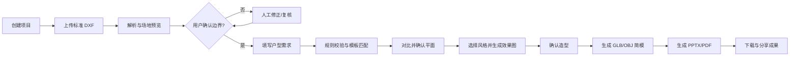
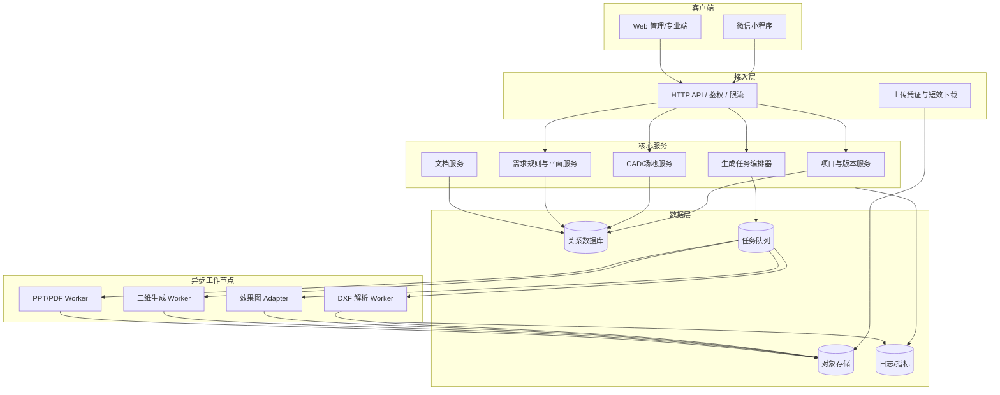

# 系统架构与流程初稿

## 1. 业务流程

## 2. 逻辑架构

## 3. 统一结构化模型

所有成果必须由同一项目版本树派生：

`Project -> SiteVersion -> RequirementVersion -> PlanVersion -> RenderVersion -> ModelVersion -> DocumentVersion`

每个下游版本保存直接上游版本 ID、生成参数哈希和状态。这样可以判断成果是否过期、追溯生成输入，并安全重试。

二维几何统一使用右手笛卡尔坐标和项目单位；入库时归一化为毫米。多边形使用逆时针外环、顺时针洞口。展示层再进行坐标平移、缩放和 Y 轴翻转。

## 4. 建议技术基线

- 客户端：微信小程序原生或 Taro；Web 使用 React + TypeScript。
- API：TypeScript/Node.js；REST 作为 MVP 边界，异步任务通过队列解耦。
- 数据：PostgreSQL；JSONB 保存演进中的空间/生成参数，对象存储保存 DXF、图片、模型和文档。
- DXF：生产候选采用 `ezdxf`；MVP 只接受约定实体与图层，解析后转换为内部 JSON。
- 二维预览：服务端 SVG/PNG，客户端 Canvas/SVG。
- 三维：结构化平面 -> GLB/OBJ；SKP 作为后续转换或插件能力。
- 文档：`python-pptx` 生成 PPTX，LibreOffice/服务转换 PDF；ReportLab 可生成降级 PDF。
- 任务：显式幂等键、指数退避、最大重试、死信队列、阶段性中间成果。

## 5. 部署单元

MVP 初期可使用模块化单体 API 加独立 Worker，避免过早微服务化：

1. `web`：小程序 API 与管理端。
2. `worker-cad`：DXF 解析、场地预览。
3. `worker-generation`：效果图供应商适配、三维和文档生成。
4. `postgres`、对象存储、队列。

接口与数据模型保持模块边界，后续可按负载拆分。

## 6. 关键安全约束

- 文件扩展名、MIME、文件头与大小联合校验；原文件私有存储。
- 下载使用短效签名 URL；项目级权限校验不可依赖前端。
- 用户素材默认不用于训练；删除项目进入可审计的异步清理。
- 生成日志不记录手机号、地址全文或原始文件内容。
- 概念方案免责声明在场地确认、成果预览和导出文档中可见。
