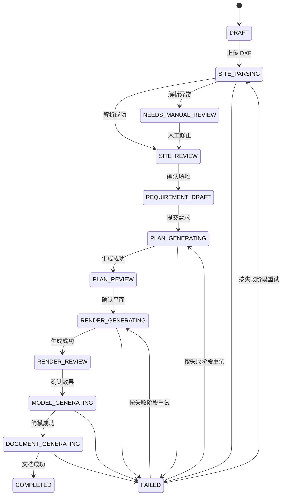

# 自建房智能方案生成小程序 - MVP 冻结说明

版本：MVP 0.1

冻结日期：2026-07-28
依据：《产品需求文档 V1.0》《两周 MVP 开发计划》

## 1. 产品目标

在限定输入条件下，验证一条可演示、可追溯、可继续工程化的端到端链路：

`标准 DXF -> 场地确认 -> 户型需求 -> 2-3 套模板化平面 -> 概念效果图 -> LOD 1-2 简模 -> PPTX/PDF`

本版本用于验证产品价值和技术路径，不输出施工图，不承诺规划合规、结构安全或施工级精度。

## 2. 本期范围

### 必须完成

- 微信小程序风格的移动端主流程，以及基础 Web 管理入口。
- 项目创建、重命名、归档、版本与任务状态查看。
- 最大 50 MB 的标准 ASCII DXF 上传；识别单一闭合地块。
- 计算地块面积、周长、边长和包围盒；确认北向、道路、入口与单位。
- 采集 1-3 层独栋住宅的结构化户型需求，并给出基础冲突提示。
- 从 10-20 个模板中匹配并形成至少 2 套平面方案。
- 展示面积、需求满足度、优缺点和基础规则校验；用户可确认一个版本。
- 提供 3-5 种风格，异步生成至少 2 张概念效果图。
- 从结构化平面输出 GLB/OBJ 简模、预览图与构件清单。
- 用固定模板生成 PPTX/PDF，并提供下载。
- 异步任务具备进度、失败原因、重试、幂等键和上游版本关联。

### 明确不做

- 复杂 DWG、不规范 CAD、外部参照、三维 CAD 和测绘图片自动解析。
- 手机端自由 CAD/平面编辑。
- 完全由图像模型生成专业平面。
- 地方规范自动审查、报建承诺、结构/机电/施工图和精确造价。
- 施工级 SKP；MVP 优先 GLB/OBJ，并提供 SketchUp 导入说明。
- 多人实时协作、复杂计费、BIM 协同和材料采购。

## 3. 输入限制

- 场地平坦或近似平坦，边界规则或近规则。
- DXF 使用毫米或米，必须由用户确认单位。
- 目标地块由单一闭合 `LWPOLYLINE` 表示，建议图层名 `SITE_BOUNDARY`。
- 道路、入口、北向可来自约定图层，也必须允许人工确认。
- 住宅为 1-3 层独栋；异常输入进入人工复核，不阻塞其他项目。

## 4. 页面清单

### 小程序端

| 编号 | 页面 | MVP 核心能力 |
|---|---|---|
| MP-01 | 登录/授权 | 微信授权或演示账号 |
| MP-02 | 项目列表 | 新建、继续、归档、状态与进度 |
| MP-03 | 新建项目 | 名称、地址、基础信息 |
| MP-04 | CAD 上传 | DXF、单位、进度、失败重试 |
| MP-05 | 场地确认 | 轮廓、面积、北向、道路、入口、风险 |
| MP-06 | 户型需求 | 层数、人口、面积、房间与优先级 |
| MP-07 | 需求校验 | 冲突、原因、调整建议与确认 |
| MP-08 | 平面方案 | 2-3 套方案、评分、面积、优缺点 |
| MP-09 | 方案对比 | 指标并列、版本确认 |
| MP-10 | 风格选择 | 风格、材质、颜色、屋顶、参考图 |
| MP-11 | 效果图任务 | 进度、画廊、确认、重试 |
| MP-12 | 三维模型 | 在线预览、构件清单、下载 |
| MP-13 | 方案文档 | PPT/PDF 预览与下载 |
| MP-14 | 项目成果 | 全部成果、版本关系、免责声明 |

### 管理端

| 编号 | 页面 | MVP 核心能力 |
|---|---|---|
| AD-01 | 任务看板 | 队列、耗时、失败、重试 |
| AD-02 | 项目复核 | DXF 异常、边界人工确认 |
| AD-03 | 模板管理 | 户型、风格、文档模板启停 |
| AD-04 | 日志 | 操作日志、错误编号、接口用量 |

## 5. 项目状态机

主状态只表达用户下一步；耗时操作由任务状态单独表达。

任务状态统一为 `QUEUED -> RUNNING -> SUCCEEDED | FAILED | CANCELED`。任务必须记录 `inputVersionId`、`idempotencyKey`、进度、错误码和重试次数。

修改已确认上游版本时，相关下游成果标记为 `STALE`，不得静默复用。

## 6. MVP 验收标准

- 用户可从新建项目走到成果下载，主链路无阻断。
- 标准测试集 DXF 解析成功率不低于 80%；能识别单一闭合边界。
- 面积和周长计算可复核；标准闭合边界面积误差不高于 1%。
- 用户可确认北向、道路、入口；无法确认边界不得生成平面。
- 需求完整保存；每项目生成至少 2 套结构化平面。
- 平面不超可建范围，显示面积、需求满足度与校验结果。
- 至少生成 2 张概念效果图和 1 份基础三维模型。
- 至少生成 PPTX 或 PDF；抽检无明显溢出、变形和指标冲突。
- 任务显示进度、失败原因并可重试；幂等重试不重复扣费或生成脏版本。
- 修改上游后，下游成果正确失效。
- 全程展示“概念方案不可直接用于施工、报建或结构安全判断”的提示。

## 7. 冻结规则

两周内新增需求默认进入 backlog。只有阻断端到端演示、数据安全或验收标准的缺陷可改变本期范围；变更必须记录原因、影响、负责人和批准人。
